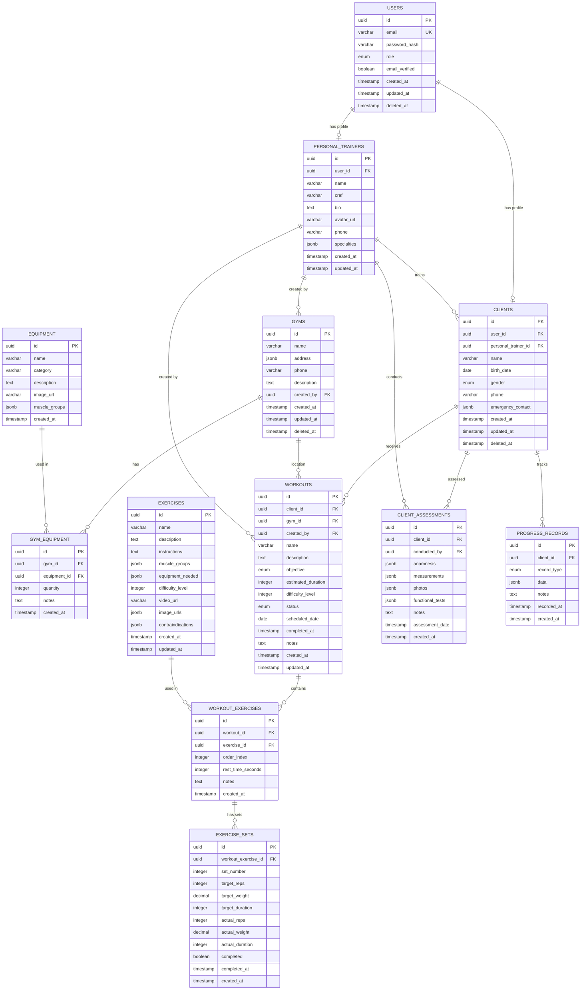

# **Modelagem de Dados e Estrutura do Banco**
# **FitCoach Pro**

**Versão:** 1.0  
**Data:** Janeiro 2025  
**Autor:** Arquiteto de Software  
**Status:** Draft  

---

## **1. Visão Geral**

### **1.1 Estratégia de Dados**
- **SGBD Principal:** PostgreSQL 15+
- **Padrão:** Normalização até 3NF com desnormalização estratégica
- **Versionamento:** Migrations com Prisma
- **Backup:** Backup automático diário + retenção de 30 dias
- **Replicação:** Read replicas para consultas pesadas

### **1.2 Convenções**
- **Nomenclatura:** snake_case para tabelas e colunas
- **Chaves Primárias:** UUID v4
- **Timestamps:** created_at, updated_at em todas as tabelas
- **Soft Delete:** deleted_at para exclusões lógicas
- **Índices:** Criados para todas as foreign keys e campos de busca

---

## **2. Diagrama Entidade-Relacionamento**



---

## **3. Definição das Tabelas**

### **3.1 Tabela: users**
```sql
CREATE TABLE users (
    id UUID PRIMARY KEY DEFAULT gen_random_uuid(),
    email VARCHAR(255) UNIQUE NOT NULL,
    password_hash VARCHAR(255) NOT NULL,
    role user_role NOT NULL,
    email_verified BOOLEAN DEFAULT FALSE,
    email_verification_token VARCHAR(255),
    password_reset_token VARCHAR(255),
    password_reset_expires TIMESTAMP,
    last_login TIMESTAMP,
    created_at TIMESTAMP DEFAULT NOW(),
    updated_at TIMESTAMP DEFAULT NOW(),
    deleted_at TIMESTAMP
);

CREATE TYPE user_role AS ENUM ('personal_trainer', 'client', 'admin');

CREATE INDEX idx_users_email ON users(email);
CREATE INDEX idx_users_role ON users(role);
CREATE INDEX idx_users_deleted_at ON users(deleted_at);
```

### **3.2 Tabela: personal_trainers**
```sql
CREATE TABLE personal_trainers (
    id UUID PRIMARY KEY DEFAULT gen_random_uuid(),
    user_id UUID NOT NULL REFERENCES users(id) ON DELETE CASCADE,
    name VARCHAR(255) NOT NULL,
    cref VARCHAR(20),
    bio TEXT,
    avatar_url VARCHAR(500),
    phone VARCHAR(20),
    specialties JSONB DEFAULT '[]',
    rating DECIMAL(3,2) DEFAULT 0.00,
    total_clients INTEGER DEFAULT 0,
    is_active BOOLEAN DEFAULT TRUE,
    created_at TIMESTAMP DEFAULT NOW(),
    updated_at TIMESTAMP DEFAULT NOW()
);

CREATE UNIQUE INDEX idx_personal_trainers_user_id ON personal_trainers(user_id);
CREATE INDEX idx_personal_trainers_cref ON personal_trainers(cref);
CREATE INDEX idx_personal_trainers_name ON personal_trainers USING gin(to_tsvector('portuguese', name));
```

### **3.3 Tabela: clients**
```sql
CREATE TABLE clients (
    id UUID PRIMARY KEY DEFAULT gen_random_uuid(),
    user_id UUID REFERENCES users(id) ON DELETE SET NULL,
    personal_trainer_id UUID NOT NULL REFERENCES personal_trainers(id),
    name VARCHAR(255) NOT NULL,
    birth_date DATE,
    gender client_gender,
    phone VARCHAR(20),
    emergency_contact JSONB,
    goals JSONB DEFAULT '[]',
    is_active BOOLEAN DEFAULT TRUE,
    created_at TIMESTAMP DEFAULT NOW(),
    updated_at TIMESTAMP DEFAULT NOW(),
    deleted_at TIMESTAMP
);

CREATE TYPE client_gender AS ENUM ('male', 'female', 'other', 'prefer_not_to_say');

CREATE INDEX idx_clients_personal_trainer ON clients(personal_trainer_id);
CREATE INDEX idx_clients_name ON clients USING gin(to_tsvector('portuguese', name));
CREATE INDEX idx_clients_deleted_at ON clients(deleted_at);
```

### **3.4 Tabela: gyms**
```sql
CREATE TABLE gyms (
    id UUID PRIMARY KEY DEFAULT gen_random_uuid(),
    name VARCHAR(255) NOT NULL,
    address JSONB NOT NULL,
    phone VARCHAR(20),
    description TEXT,
    operating_hours JSONB,
    created_by UUID NOT NULL REFERENCES personal_trainers(id),
    is_public BOOLEAN DEFAULT FALSE,
    created_at TIMESTAMP DEFAULT NOW(),
    updated_at TIMESTAMP DEFAULT NOW(),
    deleted_at TIMESTAMP
);

CREATE INDEX idx_gyms_created_by ON gyms(created_by);
CREATE INDEX idx_gyms_name ON gyms USING gin(to_tsvector('portuguese', name));
CREATE INDEX idx_gyms_deleted_at ON gyms(deleted_at);
```

### **3.5 Tabela: equipment**
```sql
CREATE TABLE equipment (
    id UUID PRIMARY KEY DEFAULT gen_random_uuid(),
    name VARCHAR(255) NOT NULL,
    category equipment_category NOT NULL,
    description TEXT,
    image_url VARCHAR(500),
    muscle_groups JSONB DEFAULT '[]',
    is_active BOOLEAN DEFAULT TRUE,
    created_at TIMESTAMP DEFAULT NOW(),
    updated_at TIMESTAMP DEFAULT NOW()
);

CREATE TYPE equipment_category AS ENUM (
    'cardio', 'strength', 'functional', 'free_weights', 'accessories'
);

CREATE INDEX idx_equipment_category ON equipment(category);
CREATE INDEX idx_equipment_name ON equipment USING gin(to_tsvector('portuguese', name));
```

### **3.6 Tabela: gym_equipment**
```sql
CREATE TABLE gym_equipment (
    id UUID PRIMARY KEY DEFAULT gen_random_uuid(),
    gym_id UUID NOT NULL REFERENCES gyms(id) ON DELETE CASCADE,
    equipment_id UUID NOT NULL REFERENCES equipment(id),
    quantity INTEGER DEFAULT 1,
    condition equipment_condition DEFAULT 'good',
    notes TEXT,
    created_at TIMESTAMP DEFAULT NOW(),
    updated_at TIMESTAMP DEFAULT NOW()
);

CREATE TYPE equipment_condition AS ENUM ('excellent', 'good', 'fair', 'poor', 'out_of_order');

CREATE UNIQUE INDEX idx_gym_equipment_unique ON gym_equipment(gym_id, equipment_id);
CREATE INDEX idx_gym_equipment_gym ON gym_equipment(gym_id);
```

### **3.7 Tabela: exercises**
```sql
CREATE TABLE exercises (
    id UUID PRIMARY KEY DEFAULT gen_random_uuid(),
    name VARCHAR(255) NOT NULL,
    description TEXT,
    instructions TEXT,
    muscle_groups JSONB NOT NULL DEFAULT '[]',
    equipment_needed JSONB DEFAULT '[]',
    difficulty_level INTEGER CHECK (difficulty_level BETWEEN 1 AND 5),
    video_url VARCHAR(500),
    image_urls JSONB DEFAULT '[]',
    contraindications JSONB DEFAULT '[]',
    tips JSONB DEFAULT '[]',
    is_active BOOLEAN DEFAULT TRUE,
    created_by UUID REFERENCES personal_trainers(id),
    created_at TIMESTAMP DEFAULT NOW(),
    updated_at TIMESTAMP DEFAULT NOW()
);

CREATE INDEX idx_exercises_name ON exercises USING gin(to_tsvector('portuguese', name));
CREATE INDEX idx_exercises_muscle_groups ON exercises USING gin(muscle_groups);
CREATE INDEX idx_exercises_equipment ON exercises USING gin(equipment_needed);
CREATE INDEX idx_exercises_difficulty ON exercises(difficulty_level);
```

### **3.8 Tabela: workouts**
```sql
CREATE TABLE workouts (
    id UUID PRIMARY KEY DEFAULT gen_random_uuid(),
    client_id UUID NOT NULL REFERENCES clients(id),
    gym_id UUID REFERENCES gyms(id),
    created_by UUID NOT NULL REFERENCES personal_trainers(id),
    name VARCHAR(255) NOT NULL,
    description TEXT,
    objective workout_objective,
    estimated_duration INTEGER, -- minutos
    difficulty_level INTEGER CHECK (difficulty_level BETWEEN 1 AND 5),
    status workout_status DEFAULT 'draft',
    scheduled_date DATE,
    completed_at TIMESTAMP,
    notes TEXT,
    client_feedback TEXT,
    client_rating INTEGER CHECK (client_rating BETWEEN 1 AND 5),
    created_at TIMESTAMP DEFAULT NOW(),
    updated_at TIMESTAMP DEFAULT NOW()
);

CREATE TYPE workout_objective AS ENUM (
    'strength', 'hypertrophy', 'endurance', 'weight_loss', 'mobility', 'rehabilitation'
);

CREATE TYPE workout_status AS ENUM ('draft', 'scheduled', 'in_progress', 'completed', 'cancelled');

CREATE INDEX idx_workouts_client ON workouts(client_id);
CREATE INDEX idx_workouts_gym ON workouts(gym_id);
CREATE INDEX idx_workouts_created_by ON workouts(created_by);
CREATE INDEX idx_workouts_status ON workouts(status);
CREATE INDEX idx_workouts_scheduled_date ON workouts(scheduled_date);
```

### **3.9 Tabela: workout_exercises**
```sql
CREATE TABLE workout_exercises (
    id UUID PRIMARY KEY DEFAULT gen_random_uuid(),
    workout_id UUID NOT NULL REFERENCES workouts(id) ON DELETE CASCADE,
    exercise_id UUID NOT NULL REFERENCES exercises(id),
    order_index INTEGER NOT NULL,
    rest_time_seconds INTEGER DEFAULT 60,
    notes TEXT,
    created_at TIMESTAMP DEFAULT NOW()
);

CREATE INDEX idx_workout_exercises_workout ON workout_exercises(workout_id);
CREATE INDEX idx_workout_exercises_order ON workout_exercises(workout_id, order_index);
```

### **3.10 Tabela: exercise_sets**
```sql
CREATE TABLE exercise_sets (
    id UUID PRIMARY KEY DEFAULT gen_random_uuid(),
    workout_exercise_id UUID NOT NULL REFERENCES workout_exercises(id) ON DELETE CASCADE,
    set_number INTEGER NOT NULL,
    target_reps INTEGER,
    target_weight DECIMAL(6,2),
    target_duration INTEGER, -- segundos
    target_distance INTEGER, -- metros
    actual_reps INTEGER,
    actual_weight DECIMAL(6,2),
    actual_duration INTEGER,
    actual_distance INTEGER,
    completed BOOLEAN DEFAULT FALSE,
    completed_at TIMESTAMP,
    rpe INTEGER CHECK (rpe BETWEEN 1 AND 10), -- Rate of Perceived Exertion
    created_at TIMESTAMP DEFAULT NOW()
);

CREATE INDEX idx_exercise_sets_workout_exercise ON exercise_sets(workout_exercise_id);
CREATE INDEX idx_exercise_sets_completed ON exercise_sets(completed);
```

### **3.11 Tabela: client_assessments**
```sql
CREATE TABLE client_assessments (
    id UUID PRIMARY KEY DEFAULT gen_random_uuid(),
    client_id UUID NOT NULL REFERENCES clients(id),
    conducted_by UUID NOT NULL REFERENCES personal_trainers(id),
    assessment_type assessment_type DEFAULT 'initial',
    anamnesis JSONB,
    measurements JSONB,
    photos JSONB DEFAULT '[]',
    functional_tests JSONB,
    body_composition JSONB,
    notes TEXT,
    assessment_date DATE NOT NULL,
    created_at TIMESTAMP DEFAULT NOW(),
    updated_at TIMESTAMP DEFAULT NOW()
);

CREATE TYPE assessment_type AS ENUM ('initial', 'progress', 'final', 'medical');

CREATE INDEX idx_assessments_client ON client_assessments(client_id);
CREATE INDEX idx_assessments_date ON client_assessments(assessment_date);
CREATE INDEX idx_assessments_type ON client_assessments(assessment_type);
```

### **3.12 Tabela: progress_records**
```sql
CREATE TABLE progress_records (
    id UUID PRIMARY KEY DEFAULT gen_random_uuid(),
    client_id UUID NOT NULL REFERENCES clients(id),
    record_type progress_record_type NOT NULL,
    data JSONB NOT NULL,
    notes TEXT,
    recorded_at TIMESTAMP NOT NULL,
    created_at TIMESTAMP DEFAULT NOW()
);

CREATE TYPE progress_record_type AS ENUM (
    'weight', 'measurements', 'photos', 'performance', 'subjective'
);

CREATE INDEX idx_progress_records_client ON progress_records(client_id);
CREATE INDEX idx_progress_records_type ON progress_records(record_type);
CREATE INDEX idx_progress_records_date ON progress_records(recorded_at);
```

---

## **4. Estruturas JSONB Detalhadas**

### **4.1 Endereço (address)**
```json
{
  "street": "Rua das Flores, 123",
  "neighborhood": "Centro",
  "city": "São Paulo",
  "state": "SP",
  "zipCode": "01234-567",
  "country": "Brasil",
  "coordinates": {
    "lat": -23.5505,
    "lng": -46.6333
  }
}
```

### **4.2 Contato de Emergência (emergency_contact)**
```json
{
  "name": "Maria Silva",
  "relationship": "mãe",
  "phone": "+55 11 99999-9999",
  "alternativePhone": "+55 11 8888-8888"
}
```

### **4.3 Anamnese (anamnesis)**
```json
{
  "medicalHistory": {
    "hasCardiacProblems": false,
    "hasBloodPressureIssues": true,
    "hasDiabetes": false,
    "hasRespiratoryProblems": false,
    "hasJointProblems": true,
    "currentMedications": ["Losartana 50mg"],
    "allergies": ["Penicilina"],
    "surgeries": []
  },
  "exerciseHistory": {
    "experience": "intermediate",
    "previousInjuries": [
      {
        "injury": "Lesão no joelho direito",
        "date": "2023-06-15",
        "recovered": true
      }
    ],
    "currentLimitations": ["Evitar agachamento profundo"]
  },
  "lifestyle": {
    "sleepHours": 7,
    "stressLevel": 3,
    "smokingHabits": "never",
    "alcoholConsumption": "social",
    "occupation": "Analista de sistemas",
    "activityLevel": "sedentary"
  }
}
```

### **4.4 Medidas (measurements)**
```json
{
  "weight": 75.5,
  "height": 175,
  "bodyFat": 18.5,
  "muscleMass": 32.1,
  "circumferences": {
    "chest": 98,
    "waist": 85,
    "hip": 95,
    "rightArm": 35,
    "leftArm": 35,
    "rightThigh": 58,
    "leftThigh": 58
  },
  "bloodPressure": {
    "systolic": 120,
    "diastolic": 80
  },
  "restingHeartRate": 65
}
```

### **4.5 Fotos de Progresso (photos)**
```json
[
  {
    "type": "front",
    "url": "https://storage.example.com/photos/client123/front_2025-01-15.jpg",
    "takenAt": "2025-01-15T10:30:00Z"
  },
  {
    "type": "side",
    "url": "https://storage.example.com/photos/client123/side_2025-01-15.jpg",
    "takenAt": "2025-01-15T10:31:00Z"
  },
  {
    "type": "back",
    "url": "https://storage.example.com/photos/client123/back_2025-01-15.jpg",
    "takenAt": "2025-01-15T10:32:00Z"
  }
]
```

---

## **5. Índices e Performance**

### **5.1 Índices Compostos**
```sql
-- Busca de treinos por cliente e data
CREATE INDEX idx_workouts_client_date ON workouts(client_id, scheduled_date DESC);

-- Busca de clientes ativos por personal trainer
CREATE INDEX idx_clients_pt_active ON clients(personal_trainer_id, is_active) 
WHERE deleted_at IS NULL;

-- Busca de equipamentos por academia
CREATE INDEX idx_gym_equipment_gym_condition ON gym_equipment(gym_id, condition);

-- Histórico de progresso por cliente e tipo
CREATE INDEX idx_progress_client_type_date ON progress_records(client_id, record_type, recorded_at DESC);
```

### **5.2 Índices Parciais**
```sql
-- Apenas usuários ativos
CREATE INDEX idx_users_active ON users(email) WHERE deleted_at IS NULL;

-- Apenas treinos não completados
CREATE INDEX idx_workouts_pending ON workouts(client_id, scheduled_date) 
WHERE status IN ('draft', 'scheduled');

-- Apenas equipamentos em bom estado
CREATE INDEX idx_equipment_available ON gym_equipment(gym_id, equipment_id) 
WHERE condition IN ('excellent', 'good');
```

### **5.3 Índices GIN para Busca Textual**
```sql
-- Busca full-text em exercícios
CREATE INDEX idx_exercises_search ON exercises 
USING gin(to_tsvector('portuguese', name || ' ' || COALESCE(description, '')));

-- Busca em dados JSONB
CREATE INDEX idx_anamnesis_search ON client_assessments 
USING gin(anamnesis);
```

---

## **6. Triggers e Funções**

### **6.1 Trigger para Updated_at**
```sql
CREATE OR REPLACE FUNCTION update_updated_at_column()
RETURNS TRIGGER AS $$
BEGIN
    NEW.updated_at = NOW();
    RETURN NEW;
END;
$$ language 'plpgsql';

-- Aplicar em todas as tabelas relevantes
CREATE TRIGGER update_users_updated_at BEFORE UPDATE ON users
    FOR EACH ROW EXECUTE FUNCTION update_updated_at_column();

CREATE TRIGGER update_personal_trainers_updated_at BEFORE UPDATE ON personal_trainers
    FOR EACH ROW EXECUTE FUNCTION update_updated_at_column();

-- ... aplicar em outras tabelas
```

### **6.2 Trigger para Contagem de Clientes**
```sql
CREATE OR REPLACE FUNCTION update_trainer_client_count()
RETURNS TRIGGER AS $$
BEGIN
    IF TG_OP = 'INSERT' THEN
        UPDATE personal_trainers 
        SET total_clients = total_clients + 1 
        WHERE id = NEW.personal_trainer_id;
        RETURN NEW;
    ELSIF TG_OP = 'DELETE' THEN
        UPDATE personal_trainers 
        SET total_clients = total_clients - 1 
        WHERE id = OLD.personal_trainer_id;
        RETURN OLD;
    END IF;
    RETURN NULL;
END;
$$ LANGUAGE plpgsql;

CREATE TRIGGER trigger_update_client_count
    AFTER INSERT OR DELETE ON clients
    FOR EACH ROW EXECUTE FUNCTION update_trainer_client_count();
```

### **6.3 Função para Cálculo de Progresso**
```sql
CREATE OR REPLACE FUNCTION calculate_client_progress(
    p_client_id UUID,
    p_start_date DATE,
    p_end_date DATE
)
RETURNS JSONB AS $$
DECLARE
    initial_weight DECIMAL;
    current_weight DECIMAL;
    weight_change DECIMAL;
    completed_workouts INTEGER;
    total_workouts INTEGER;
    adherence_rate DECIMAL;
BEGIN
    -- Peso inicial
    SELECT (data->>'weight')::DECIMAL INTO initial_weight
    FROM progress_records 
    WHERE client_id = p_client_id 
      AND record_type = 'weight'
      AND recorded_at >= p_start_date
    ORDER BY recorded_at ASC
    LIMIT 1;
    
    -- Peso atual
    SELECT (data->>'weight')::DECIMAL INTO current_weight
    FROM progress_records 
    WHERE client_id = p_client_id 
      AND record_type = 'weight'
      AND recorded_at <= p_end_date
    ORDER BY recorded_at DESC
    LIMIT 1;
    
    -- Cálculo de aderência
    SELECT COUNT(*) INTO total_workouts
    FROM workouts 
    WHERE client_id = p_client_id 
      AND scheduled_date BETWEEN p_start_date AND p_end_date;
    
    SELECT COUNT(*) INTO completed_workouts
    FROM workouts 
    WHERE client_id = p_client_id 
      AND scheduled_date BETWEEN p_start_date AND p_end_date
      AND status = 'completed';
    
    weight_change := COALESCE(current_weight - initial_weight, 0);
    adherence_rate := CASE 
        WHEN total_workouts > 0 THEN (completed_workouts::DECIMAL / total_workouts) * 100
        ELSE 0
    END;
    
    RETURN jsonb_build_object(
        'weightProgress', jsonb_build_object(
            'initial', initial_weight,
            'current', current_weight,
            'change', weight_change
        ),
        'adherence', jsonb_build_object(
            'totalWorkouts', total_workouts,
            'completedWorkouts', completed_workouts,
            'rate', adherence_rate
        )
    );
END;
$$ LANGUAGE plpgsql;
```

---

## **7. Políticas de Segurança**

### **7.1 Row Level Security (RLS)**
```sql
-- Habilitar RLS nas tabelas sensíveis
ALTER TABLE clients ENABLE ROW LEVEL SECURITY;
ALTER TABLE workouts ENABLE ROW LEVEL SECURITY;
ALTER TABLE client_assessments ENABLE ROW LEVEL SECURITY;
ALTER TABLE progress_records ENABLE ROW LEVEL SECURITY;

-- Personal trainers só veem seus próprios clientes
CREATE POLICY clients_personal_trainer_policy ON clients
    FOR ALL TO authenticated
    USING (personal_trainer_id = current_setting('app.current_trainer_id')::UUID);

-- Clientes só veem seus próprios dados
CREATE POLICY clients_self_policy ON clients
    FOR SELECT TO authenticated
    USING (user_id = current_setting('app.current_user_id')::UUID);
```

### **7.2 Criptografia de Dados Sensíveis**
```sql
-- Extensão para criptografia
CREATE EXTENSION IF NOT EXISTS pgcrypto;

-- Função para criptografar dados médicos
CREATE OR REPLACE FUNCTION encrypt_medical_data(data TEXT)
RETURNS TEXT AS $$
BEGIN
    RETURN encode(encrypt(data::bytea, current_setting('app.encryption_key'), 'aes'), 'base64');
END;
$$ LANGUAGE plpgsql SECURITY DEFINER;

-- Função para descriptografar dados médicos
CREATE OR REPLACE FUNCTION decrypt_medical_data(encrypted_data TEXT)
RETURNS TEXT AS $$
BEGIN
    RETURN convert_from(decrypt(decode(encrypted_data, 'base64'), current_setting('app.encryption_key'), 'aes'), 'UTF8');
END;
$$ LANGUAGE plpgsql SECURITY DEFINER;
```

---

## **8. Backup e Disaster Recovery**

### **8.1 Estratégia de Backup**
```bash
#!/bin/bash
# Script de backup automático

DB_NAME="fitcoach_prod"
BACKUP_DIR="/backups/postgresql"
DATE=$(date +"%Y%m%d_%H%M%S")

# Backup completo
pg_dump -h localhost -U postgres -d $DB_NAME -f "$BACKUP_DIR/full_backup_$DATE.sql"

# Backup apenas dos dados (sem schema)
pg_dump -h localhost -U postgres -d $DB_NAME --data-only -f "$BACKUP_DIR/data_backup_$DATE.sql"

# Compressão
gzip "$BACKUP_DIR/full_backup_$DATE.sql"
gzip "$BACKUP_DIR/data_backup_$DATE.sql"

# Limpeza de backups antigos (manter 30 dias)
find $BACKUP_DIR -name "*.gz" -mtime +30 -delete
```

### **8.2 Monitoramento de Saúde**
```sql
-- View para monitoramento
CREATE VIEW system_health AS
SELECT 
    'database_size' as metric,
    pg_size_pretty(pg_database_size(current_database())) as value,
    NOW() as checked_at
UNION ALL
SELECT 
    'active_connections' as metric,
    COUNT(*)::TEXT as value,
    NOW() as checked_at
FROM pg_stat_activity 
WHERE state = 'active'
UNION ALL
SELECT 
    'total_users' as metric,
    COUNT(*)::TEXT as value,
    NOW() as checked_at
FROM users 
WHERE deleted_at IS NULL;
```

---

## **9. Migrations e Versionamento**

### **9.1 Schema Prisma**
```prisma
// schema.prisma
generator client {
  provider = "prisma-client-js"
}

datasource db {
  provider = "postgresql"
  url      = env("DATABASE_URL")
}

model User {
  id                      String    @id @default(dbgenerated("gen_random_uuid()")) @db.Uuid
  email                   String    @unique @db.VarChar(255)
  passwordHash            String    @map("password_hash") @db.VarChar(255)
  role                    UserRole
  emailVerified           Boolean   @default(false) @map("email_verified")
  emailVerificationToken  String?   @map("email_verification_token") @db.VarChar(255)
  passwordResetToken      String?   @map("password_reset_token") @db.VarChar(255)
  passwordResetExpires    DateTime? @map("password_reset_expires")
  lastLogin              DateTime? @map("last_login")
  createdAt              DateTime  @default(now()) @map("created_at")
  updatedAt              DateTime  @updatedAt @map("updated_at")
  deletedAt              DateTime? @map("deleted_at")

  personalTrainer PersonalTrainer?
  client         Client?

  @@map("users")
}

enum UserRole {
  personal_trainer
  client
  admin

  @@map("user_role")
}

// ... outros modelos
```

### **9.2 Exemplo de Migration**
```sql
-- Migration: 001_create_initial_schema.sql
BEGIN;

-- Criar tipos ENUM
CREATE TYPE user_role AS ENUM ('personal_trainer', 'client', 'admin');
CREATE TYPE client_gender AS ENUM ('male', 'female', 'other', 'prefer_not_to_say');

-- Criar tabelas principais
CREATE TABLE users (
    -- definição da tabela
);

-- Criar índices
CREATE INDEX idx_users_email ON users(email);

-- Inserir dados iniciais
INSERT INTO equipment (name, category, description) VALUES
('Esteira', 'cardio', 'Equipamento para corrida e caminhada'),
('Supino Reto', 'strength', 'Banco para exercícios de peito'),
('Leg Press', 'strength', 'Máquina para exercícios de pernas');

COMMIT;
```

---

**Aprovações:**
- [ ] DBA
- [ ] Tech Lead
- [ ] Security Engineer
- [ ] DevOps Engineer

**Histórico de Versões:**
- v1.0 - Janeiro 2025 - Modelagem inicial do banco de dados